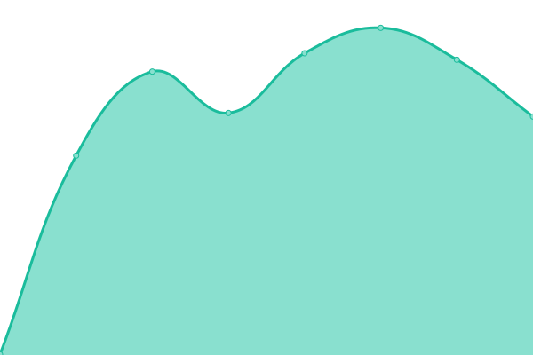
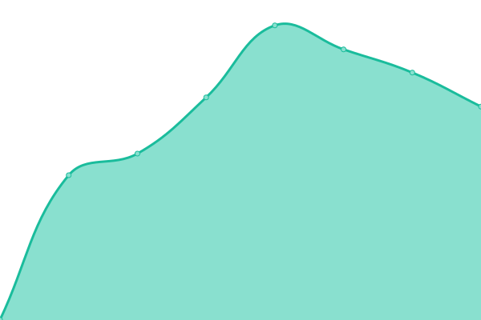
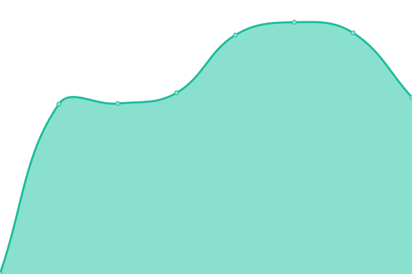

# [📈 Live Status](https://status.bogach.es): <!--live status--> **🟩 All systems operational**

This repository contains the open-source uptime monitor and status page for [Kyryl Bogach](www.kyryl.bogach.es), powered by [Upptime](https://github.com/upptime/upptime).

With [Upptime](https://upptime.js.org), you can get your own unlimited and free uptime monitor and status page, powered entirely by a GitHub repository. We use [Issues](https://github.com/kyryl-bogach/upptime/issues) as incident reports, [Actions](https://github.com/kyryl-bogach/upptime/actions) as uptime monitors, and [Pages](https://status.bogach.es) for the status page.

<!--start: status pages-->
<!-- This summary is generated by Upptime (https://github.com/upptime/upptime) -->
<!-- Do not edit this manually, your changes will be overwritten -->
<!-- prettier-ignore -->
| URL | Status | History | Response Time | Uptime |
| --- | ------ | ------- | ------------- | ------ |
|  [kyryl.bogach.es](https://kyryl.bogach.es) | 🟩 Up | [kyryl-bogach-es.yml](https://github.com/kyryl-bogach/upptime/commits/HEAD/history/kyryl-bogach-es.yml) | 

 689ms
     
 | 

<a href="https://status.bogach.es/history/kyryl-bogach-es">100.00%</a>
    

|  [reservas.mudic.es](https://reservas.mudic.es) | 🟩 Up | [reservas-mudic-es.yml](https://github.com/kyryl-bogach/upptime/commits/HEAD/history/reservas-mudic-es.yml) | 

 677ms
     
 | 

<a href="https://status.bogach.es/history/reservas-mudic-es">100.00%</a>
    

|  [clinicafabregat.com](https://clinicafabregat.com) | 🟩 Up | [clinicafabregat-com.yml](https://github.com/kyryl-bogach/upptime/commits/HEAD/history/clinicafabregat-com.yml) | 

 3143ms
     
 | 

<a href="https://status.bogach.es/history/clinicafabregat-com">98.92%</a>
    

|  [senoshaidodelasmanos.bogach.es](https://senoshaidodelasmanos.bogach.es/) | 🟩 Up | [senoshaidodelasmanos-bogach-es.yml](https://github.com/kyryl-bogach/upptime/commits/HEAD/history/senoshaidodelasmanos-bogach-es.yml) | 

 868ms
     
 | 

<a href="https://status.bogach.es/history/senoshaidodelasmanos-bogach-es">100.00%</a>
    

|  [admin.angelopezdietista.com](https://admin.angelopezdietista.com) | 🟩 Up | [admin-angelopezdietista-com.yml](https://github.com/kyryl-bogach/upptime/commits/HEAD/history/admin-angelopezdietista-com.yml) | 

 427ms
     
 | 

<a href="https://status.bogach.es/history/admin-angelopezdietista-com">100.00%</a>
    

|  [grazindafranco.com](https://grazindafranco.com) | 🟩 Up | [grazindafranco-com.yml](https://github.com/kyryl-bogach/upptime/commits/HEAD/history/grazindafranco-com.yml) | 

 1077ms
     
 | 

<a href="https://status.bogach.es/history/grazindafranco-com">100.00%</a>
    

|  [mail.bogach.es](https://mail.bogach.es) | 🟩 Up | [mail-bogach-es.yml](https://github.com/kyryl-bogach/upptime/commits/HEAD/history/mail-bogach-es.yml) | 

 659ms
     
 | 

<a href="https://status.bogach.es/history/mail-bogach-es">100.00%</a>
    

<!--end: status pages-->

[**Visit our status website →**](https://status.bogach.es)

## 📄 License

- Powered by: [Upptime](https://github.com/upptime/upptime)
- Code: [MIT](./LICENSE) © [Kyryl Bogach](www.kyryl.bogach.es)
- Data in the `./history` directory: [Open Database License](https://opendatacommons.org/licenses/odbl/1-0/)
